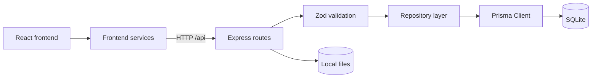

# AppSec Report Builder

> **Status:** active development · local-first · not production-ready

AppSec Report Builder is a local application for organising application-security assessment data and preparing structured report views.

The current version is designed for a trusted local workstation. It has no authentication or authorisation model and must not be exposed to an untrusted network.

## Quick start

### Requirements

- Node.js `24.15.0` (see `.nvmrc`)
- npm
- Git

### Setup

```powershell
git clone https://github.com/cieslikprzemyslaw/application-security-reports.git
cd application-security-reports

Copy-Item .env.example .env
npm install
npm run db:generate
npm run db:migrate
npm run db:seed
npm run dev
```

Default local addresses:

- frontend: `http://localhost:5173`
- API: `http://localhost:3001`
- health check: `http://localhost:3001/api/health`

`npm run db:reset` deletes the local development database contents, reapplies migrations, and reseeds the database.

## Current architecture



Runtime application data is stored in SQLite through Prisma. JSON files under `prisma/seed/` are seed inputs only.

The production request path is:

```text
React page or hook
  → frontend service
  → Express route
  → Zod request validation
  → repository
  → Prisma
  → SQLite
```

Route handlers do not access Prisma Client directly.

## Implemented backend surface

The API currently includes:

- Companies CRUD, overview, archive/restore, and company-logo upload/read/delete
- Assessments CRUD, company-scoped listing, workspace overview, and complete command
- Threats CRUD with assessment scoping
- Evidence CRUD with assessment and threat relationship validation
- Settings read/update
- Report view assembly through `GET /api/reports/:id`
- health endpoint
- safe API error envelopes and local CORS restrictions

There is no public Activity API route.

The report API currently assembles a report view and snapshot for reading. The schema and repository support immutable `ReportVersion` snapshots, but public report-version creation/list endpoints are not implemented yet.

## Frontend scope

The main frontend workflow is company-scoped:

```text
Company workspace
  → Assessments
    → Assessment overview
    → Threats
    → Evidence
    → Reports
```

Company and assessment workflows use the frontend service layer and API. Some global presentation screens still use local fixture data, including the global Threats view, Activity feed, and parts of report preview navigation. See [Frontend architecture](docs/public/frontend.md).

## Local storage boundaries

- SQLite database: configured through `DATABASE_URL`
- company logos: `uploads/company-logos/`
- evidence files that already exist locally: `uploads/evidence/`
- seed data: `prisma/seed/*.json`
- report snapshots: `ReportVersion.snapshot` in SQLite

Evidence metadata and HTTP exchanges are stored in SQLite. The current Evidence API does not implement multipart file upload. Static evidence serving exists for supported files already present under `uploads/evidence/`.

Database transactions do not automatically roll back filesystem operations. See [Storage and deletion](docs/public/storage.md) for the exact limitations.

## Project commands

The commands below are registered in `package.json`.

```powershell
npm run dev
npm run dev:client
npm run api:dev

npm run db:generate
npm run db:migrate
npm run db:seed
npm run db:reset
npm run db:validate
npm run db:studio

npm run test
npm run test:frontend
npm run test:backend
npm run typecheck
npm run lint
npm run format:check
npm run build

npm run validate
```

Focused suites are documented in [Testing](docs/public/testing.md).

## Documentation

- [Documentation index](docs/public/README.md)
- [Project overview](docs/public/overview.md)
- [Local development](docs/public/local-development.md)
- [Architecture](docs/public/architecture.md)
- [Backend](docs/public/backend.md)
- [Frontend](docs/public/frontend.md)
- [Data flow](docs/public/data-flow.md)
- [Storage and deletion](docs/public/storage.md)
- [API reference](docs/public/api.md)
- [Testing](docs/public/testing.md)
- [Issue workflow](docs/public/issues.md)
- [GitHub Wiki](https://github.com/cieslikprzemyslaw/application-security-reports/wiki)

## Security status

This repository is a learning and product-development project. Do not store real customer secrets, credentials, access tokens, regulated data, or sensitive production evidence in the current version.

Security vulnerabilities should not be disclosed through a public issue.
