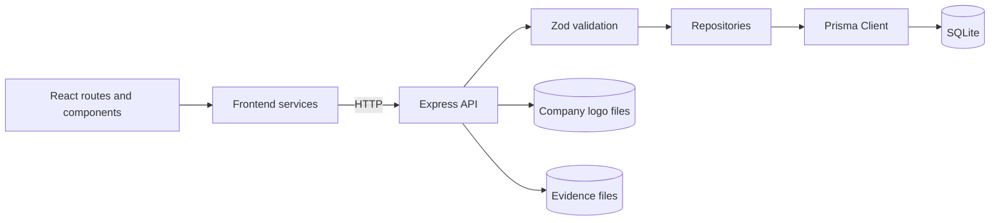

# Architecture

## High-level architecture



## Layer responsibilities

### Frontend routes and components

- render page states;
- keep company and assessment context;
- call frontend services;
- do not access Prisma or local filesystem paths;
- treat API failures as explicit UI states.

### Frontend services

Files under `src/services/`:

- construct API requests;
- encode query parameters;
- parse the common response envelope;
- map HTTP failures to `ApiError`;
- expose typed methods to pages and hooks.

### Express routes

Files under `server/routes/`:

- validate route parameters, query parameters, and request bodies;
- enforce cross-record rules;
- map repository results to API DTOs;
- return safe status codes and error envelopes;
- never access Prisma Client directly.

### Runtime validation

Zod schemas validate:

- prefixed identifiers;
- closed value sets;
- request DTOs;
- response DTOs;
- file metadata;
- report snapshots;
- cross-field Settings rules.

Unknown request fields and client-controlled system fields are rejected where the schema requires strict input.

### Repositories

Files under `server/database/repositories/`:

- are the application persistence boundary;
- own Prisma queries;
- generate backend IDs;
- map Prisma rows to domain objects;
- use transactions for multi-write relationship updates;
- translate Prisma failures to repository errors.

### Prisma and SQLite

`server/lib/prisma.ts` creates the shared Prisma Client with the Better SQLite3 adapter.

`DATABASE_URL` must be available before the client is created.

## Composition

The production server starts in `server/index.ts`.

```text
server/index.ts
  → repository factories
  → startApiServer
  → createApiApp
  → createApiRouter
  → domain routers
```

Routers are registered only when their required repositories are provided.

## Trust boundaries

1. browser input to frontend service;
2. HTTP request to Express route;
3. validated route data to repository;
4. repository input to Prisma and SQLite;
5. validated upload bytes to local filesystem;
6. stored report data to report view and snapshot;
7. local files to static evidence responses.

## Error handling

Public API errors use:

```json
{
  "error": {
    "code": "VALIDATION_ERROR",
    "message": "Request validation failed",
    "details": []
  }
}
```

Public errors must not expose:

- SQL;
- Prisma internals;
- stack traces;
- absolute local paths;
- secrets;
- raw unexpected exception messages.

## Security boundary

The current local-first architecture has no authentication or authorisation. Local execution reduces exposure but is not a replacement for identity, access control, tenant isolation, monitoring, or hardened deployment.
